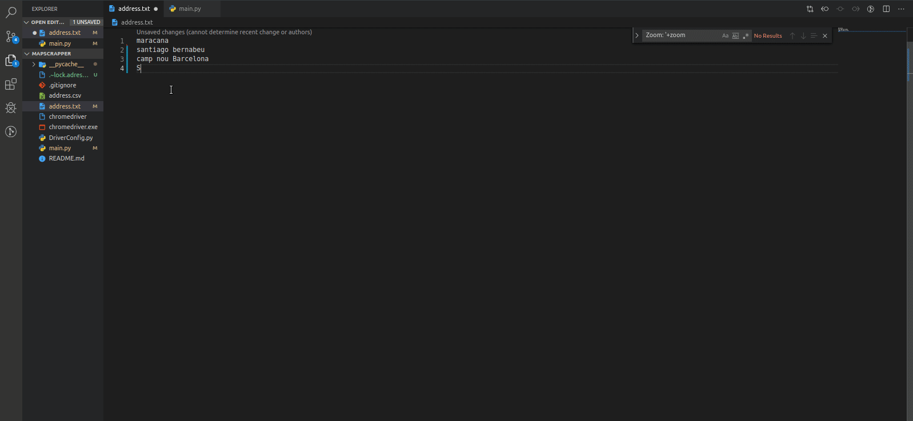

Collaborators: @RodPin @gabrielmatos26 @cristianolopessantos

# GoogleMaps coordinate scrapper

Currently only working with zoom 17z from google maps

## How to use it

Install chrome webDriver => https://chromedriver.storage.googleapis.com/index.html?path=81.0.4044.138/

Download Python3 => https://www.python.org/downloads/release/python-380/

Install selenium => `pip install -U selenium`

Edit `address.txt` to search for your addresses

Run => `python main.py`

### Using .csv

With csv you have to edit `address` variable to build your own search

Default separator `";"` but you can change it for whatever you want
